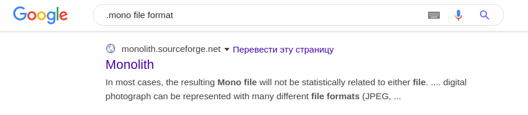

# Misc | Illegal Flag

## Информация

> Arbalests of Siberia начинает захватывать не только материальные, но и интеллектуальные ресурсы человечества — под её контроль постепенно переходят патенты и авторские права от независимых учёных, разработчиков и исследователей.
> 
> Поэтому наши сторонники задались простым вопросом: как обойти закон и безопасно для себя передать данные, защищённые чужим авторским правом?
> 
> Не знаем, что они придумали, но, кажется, у них это получилось.

## Описание

Выданный [файл](task/flag.mono) имеет расширение `.mono` и не содержит внутри себя чего-то распознаваемого, утилита `file` также не помогает его распознать.

## Решение

В этом задании нужно зацепиться за две вещи:

1. в названии и описании таска что-то говорится об обходе авторских прав
2. файл с флагом имеет формат `.mono`

По самому простому запросу нужная статья находится на первой странице:

[Monolith](http://monolith.sourceforge.net) — это простая утилита, которая "призвана" обойти авторское право и открыто передавать защищённые файлы. На самом деле, это скорее философский эксперимент, чем реальная технология:

`Monolith was developed on a lark. It is a philosophical experiment, a curiosity, and perhaps even a hare-brained scheme. In any case, Monolith is meant to stir debate: a perfect, flawless system would not stir debate very well, would it? Monolith exists comfortably in a world of logical gymnastics. The real world of copyright does not operate in a logical fashion. Thus, a word of warning: if you apply Monolith in the real world, your legal mileage may vary.`

В любом случае, при взгляде на статью становится понятно, что делает утилита — она просто ксорит файл с одним единственным неизменным звуковым файлом, который полностью принадлежит автору утилиты. Чтобы получить флаг, нужно проксорить "обратно".

[Пример решения](task/exploit.sh)

## Флаг

`Cup{br34k1ng_th3_d1g1t4l_c0pyr1ght}`
