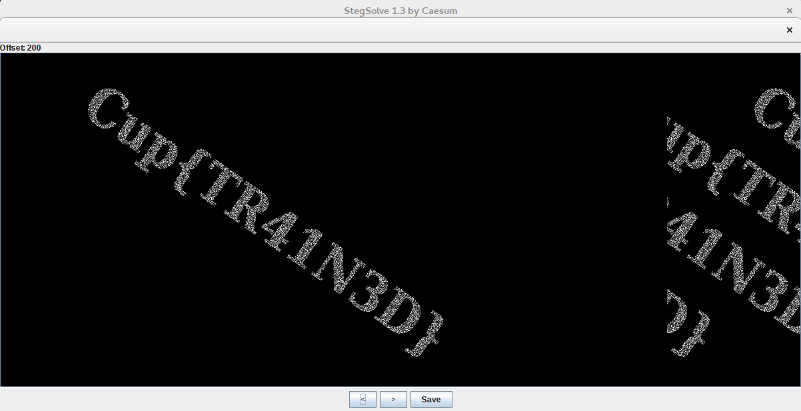

# Stegano | Eyes Training

## Информация

> Давно вы делали разминку для глаз? 
> 
> В бегущем мире, разумеется, ни у кого нет на это времени...
> 
> Но мы настаиваем, чтобы вы отвлеклись от рутины и немного подвигали глазами.
> 
> Да, прямо сейчас!

## Описание

Вся [картинка](task/training.png) представляет из себя чёрно-белый шум, в котором, на первый взгляд, ничего нет. 

## Решение

Изображение на самом деле является случайно-точечной [стереокартинкой](https://en.wikipedia.org/wiki/Autostereogram), в которой текстом написан флаг. Есть два пути решения:

1. последовать совету из описания и попробовать увидеть текст на картинке, применив обычную технику рассматривания стереокартинок
2. воспользоваться **Stegsolve** (или другой похожей утилитой) и накладывать изображение на себя со смещением, пока не станет видно текст 

Увиденный на картинке текст и будет флагом.

## Флаг

`Cup{TR41N3D}`
