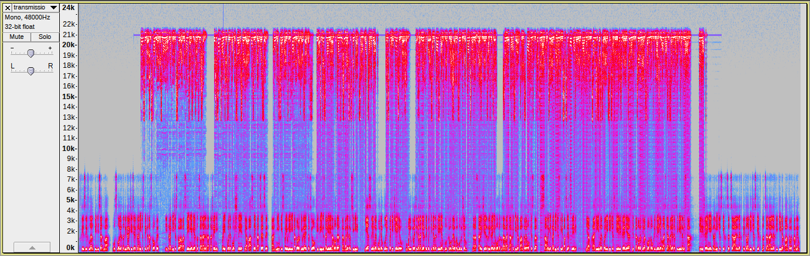

# Stegano | Leaked Docs

## Информация

> Кто бы мог подумать, что радио до сих пор существует?
> 
> Мы сами не верили, пока случайно не обнаружили радиопередачи с заседаний совета директоров Arbalests of Siberia.
> 
> Они думают, что если будут использовать технологии позапрошлого века, то смогут скрыть свои секреты от нас!
> 
> У них и утечка документов недавно была, представляете? Снова через какой-то древний протокол. 
> 
> Те файлы зашифрованы, но сегодня мы записали их новую передачу. Возможно, там есть пароль?

## Описание

Архив содержит запароленный файл `flag.txt`. В аудиозаписи автоматический голос озвучивает искажённое выступление [академика Сахарова](https://ru.wikipedia.org/wiki/Сахаров,_Андрей_Дмитриевич) на съезде депутатов СССР 1989 года. В самом тексте что-то говорится про экономику, политику, кризис, решение проблем, и совсем ничего про пароль от архива.

## Решение

Если посмотреть на спектрограмму аудиофайла, можно заметить, что на высоких частотах "что-то есть":

При этом этот звук сильно искажён, разобрать его не получается. 

Если сравнить верхнюю спектрограмму с нижней, можно увидеть некоторое сходство: верхняя спектрограмма визуально похожа на нижнюю, но как будто "отражена по-вертикали". То есть, в звуке на самом деле скрыта не только автоматическая речь, но и ещё какой-то звук, который нужно как-то вернуть на его частоты.

Достаточно просто инвертировать весь спектр по частоте 21 кГц — именно на этой частоте мы видим явный "разрез". Для этого, например, воспользоваться утилитой [deinvert](https://github.com/windytan/deinvert). А весь процесс, применённый к звуке в этом задании, называется [Voice inversion](https://en.wikipedia.org/wiki/Voice_inversion), первые предложения с этой статьи также слышны в радиопередаче после инвертирования.

## Флаг

`Cup{cut_4nd_glu3_th3_s0und_sp3ctrum}`
