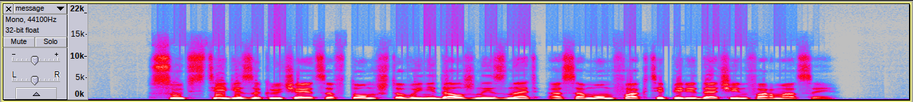
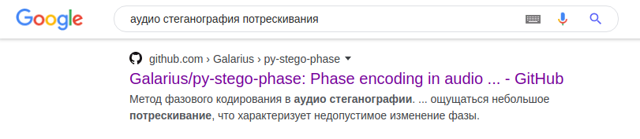

# Stegano | Voice Message

## Информация

> На дворе 2169 год, но ваш знакомый до сих пор использует эти \[ДАННЫЕ УДАЛЕНЫ\]ые войсы из доисторических времён интернета.
> 
> Естественно, в вас просыпается дух предков, и вам хочется проигнорировать его сообщение.
> 
> Но вдруг ваш знакомый продиктовал вам флаг?

## Описание

В [аудиозаписи](task/message.wav) автоматический голос сообщает: "где-то в этом сообщении спрятан флаг". Никакой другой полезной информации голос не сообщает. 

## Решение

Слушаем файл и слышим характерные "потрескивания" на фоне голоса. Эти же потрескивания видны и в спектрограмме (вертикальные линии):

Для тех, кто знаком со звуковой стеганографией, эти потрескивания сразу же напомнят [фазовое кодирование](https://ru.wikipedia.org/wiki/Стеганография#Фазовое_кодирование) — один из самых простых и эффективных методов скрытия информации. Этот метод довольно популярен, и его часто описывают в исследованиях.

Чтобы решить таск, нужно написать (или найти в интернете) код, который умеет разворачивать фазовое кодирование, и перебрать длину сегмента. По простому запросу [такой код на Python](https://github.com/Galarius/py-stego-phase) находится на 4 строке выдачи. Кстати, как раз с помощью этого репозитория и был спрятан флаг!

Если взять тот код, его придётся немного подправить для конкретного WAV файла — он умеет работать только со звуком определённого формата. 

[Пример решения](task/exploit.sh)

## Флаг

`Cup{I'm_n0t_LSB_pl34s3_d0n't_l00k_4t_my_p4r1ty_b1t!!!}`
